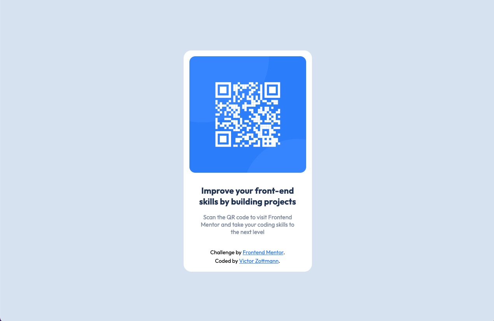

# Frontend Mentor - QR code component

This is my solution to the [QR code component challenge on Frontend Mentor](https://www.frontendmentor.io/challenges/qr-code-component-iux_sIO_H).

### Screenshot

Solution URL: [https://victorzottmann.github.io/qr-code-component/](https://victorzottmann.github.io/qr-code-component/)

### Built with
- CSS custom properties
- Flexbox
